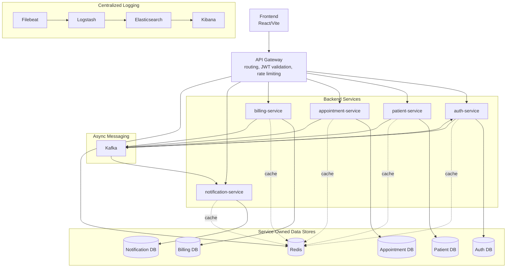
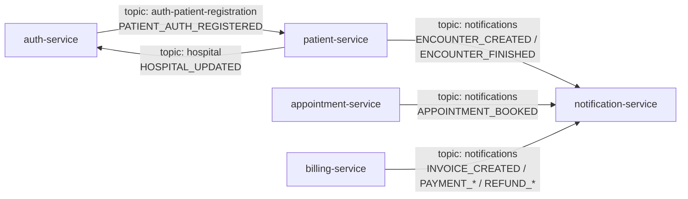

# MediTrack

MediTrack is a multi-tenant hospital workflow platform built with a Spring Boot microservices architecture. It supports hospital-branded login, role-based access, patient management, appointment scheduling, encounters, notifications, and billing foundations.

The project is designed to demonstrate both product thinking and backend depth: service-owned databases, API Gateway routing, Kafka-driven events, optimistic locking for booking safety, Redis-backed rate limiting, and centralized logging with ELK.

## What The Product Solves

MediTrack gives hospitals one platform to manage:

- hospital-scoped patient records and registration
- doctors, nurses, staff, and practitioner workflows
- appointment scheduling and doctor availability
- OPD, IPD, ER, and teleconsult encounters
- notifications such as confirmations, reminders, and visit summaries
- tenant-specific branding, login, and access control

Each hospital acts as an isolated tenant with its own login page, branding, users, patients, doctors, appointments, and operational data.

## System Design

MediTrack follows a microservice-based backend design with service-owned persistence. Cross-service relationships are modeled with UUID references and service communication instead of shared database joins.



### Core Services

| Service | Responsibility |
|---|---|
| `api-gateway` | Main HTTP entry point, JWT validation, CORS, Redis-backed rate limiting |
| `auth-service` | Login, registration, JWT issuance, hospital login projection |
| `patient-service` | Hospitals, patients, diseases, medical professionals, encounters |
| `appointment-service` | Doctor schedules, time-off, bookings, appointment lifecycle |
| `notification-service` | Notification requests, delivery attempts, Kafka event consumption |
| `billing-service` | Billing accounts, invoices, invoice items, payments, refunds |

### Event Flow



### Infrastructure

- PostgreSQL per service
- Kafka for async events and projection sync
- Redis for gateway rate limiting and Spring Cache
- Elasticsearch, Logstash, Kibana, and Filebeat for centralized logging
- Trace IDs propagated across HTTP and Kafka flows

## Product Features

- **Hospital-branded login:** routes like `/login/citycare`, dynamic logo/colors/welcome text, tenant-aware login context.
- **Role-based workspace:** role-specific navigation for `ADMIN`, `MANAGER`, `DOCTOR`, `NURSE`, `RECEPTION`, `STAFF`, and `PATIENT`.
- **Patient management:** hospital-scoped records, search/filtering, active status, disease history, duplicate detection using phone/email/Aadhaar/PAN.
- **Medical professionals:** hospital-scoped directory, specialty, registration details, consultation fee metadata.
- **Appointment scheduling:** doctor search, schedules, time-off, slot generation, booking validation, and lifecycle states such as `REQUESTED`, `CONFIRMED`, `CHECKED_IN`, `COMPLETED`, `CANCELLED`, and `NO_SHOW`.
- **Encounters:** OPD, IPD, ER, and teleconsult records linked to patients and optionally appointments.
- **Notifications:** appointment confirmations, reminders, visit summaries, persisted delivery attempts, and event-driven creation.
- **Billing:** billing accounts, invoices, invoice items, payments, refunds, and notification events for billing workflows.

## Engineering Highlights

### Service-Owned Databases

Each major service owns its own PostgreSQL database. Relationships inside a service can use JPA associations, while cross-service relationships use UUID references.

Example:

- `Patient -> PatientDisease`: JPA relationship inside patient-service
- `Appointment -> Patient`: logical UUID relationship across services

### Concurrency-Safe Booking

`appointment-service` validates doctor schedules, time off, active patient/doctor status, and appointment overlap. Optimistic locking is used to avoid double-booking when concurrent requests target the same doctor slot.

### Hospital-Scoped Authorization

JWTs contain `hospitalId`, `hospitalCode`, and `role`. The API Gateway validates tokens before routing, and secured services validate them again for defense in depth.

### Event-Driven Architecture

Kafka is used for async side effects and projections:

- auth patient signup -> patient profile bootstrap
- hospital updates -> auth-side hospital projection
- appointment, encounter, billing events -> notification records

### Redis Rate Limiting And Cache

The gateway uses Spring Cloud Gateway `RequestRateLimiter` with Redis token-bucket state. Services also use Redis-backed Spring Cache with TTL-based expiration and write-side eviction.

### Centralized Logging With ELK

Filebeat reads Docker logs, Logstash processes them, Elasticsearch stores them, and Kibana provides search/filtering.

## Running The Project

### Prerequisites

- Docker Desktop
- Node.js `22.x`
- npm

### Start The Backend

From the repo root:

```powershell
docker compose down -v
docker compose build
docker compose up -d
```

For a faster rebuild after service changes:

```powershell
docker compose build auth-service patient-service appointment-service notification-service api-gateway
docker compose up -d
```

### Start The Frontend

```powershell
cd meditrack-frontend
npm install
npm run dev -- --host 0.0.0.0 --port 3000
```

### Local URLs

- Frontend: `http://localhost:3000`
- Hospital login: `http://localhost:3000/login/citycare`
- API Gateway: `http://localhost:8000`
- Kibana: `http://localhost:5601`
- Elasticsearch: `http://localhost:9200`

## Current Scope And Next Steps

Implemented strongly:

- hospital-branded auth flow
- multi-tenant hospital data model
- patient and appointment core domains
- notification persistence and event consumption
- billing workflow foundations
- gateway protection, rate limiting, Redis cache, and ELK logging

Next improvements:

- richer clinical encounter modules
- stronger dashboard summary APIs
- expanded appointment status update APIs
- production notification providers
- more polished billing workflows
