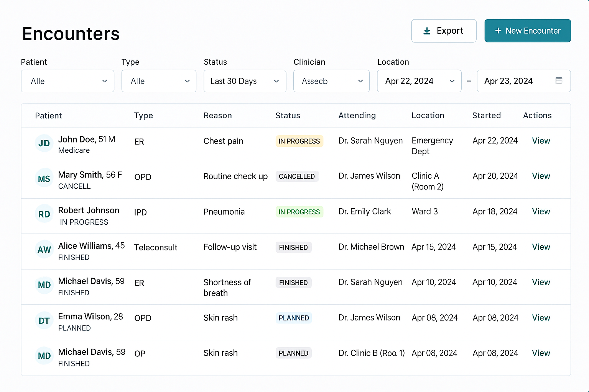
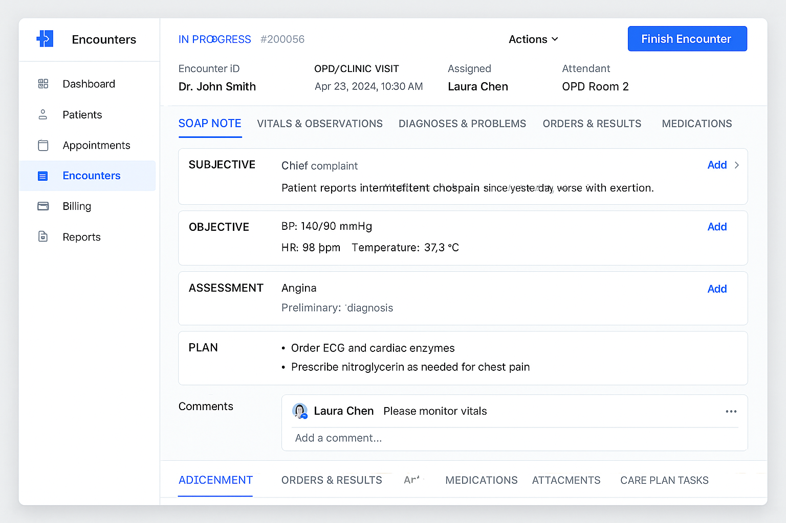

# 🏥 Patient Service Overview

**Patient Service** mainly consists of three modules:
1. **Patients**
2. **Appointments / Scheduling**
3. **Encounters**

---

## 1. Patients

### 1. Hospitals

#### Table: `hospitals`

- `id` (uuid, PK)
- `name`
- `code` (short unique code per hospital)
- `address`
- `phone`
- `email`
- `created_at`
- `updated_at`

---

### 2. Patients (Per-Hospital)

> Same human can exist as multiple patients across different hospitals.  
> Each hospital maintains its own patient record.

#### Table: `patients`

- `id` (uuid, PK)
- `hospital_id` (fk `hospitals.id`)
- `user_id` (nullable, fk `users.id`) – if the patient has a login
- `name`
- `address`
- `phone`
- `aadhar`
- `pan`
- `email`
- `date_of_birth` (nullable)
- `gender` (nullable, enum)
- `is_active` (bool)
- `created_at`
- `updated_at`

#### Table: `patient_diseases`

Stores the patient's **list of diseases** (chronic or otherwise).

- `id` (uuid, PK)
- `patient_id` (fk `patients.id`)
- `disease_name`
- `disease_code` (nullable, e.g. ICD-10)
- `is_chronic` (bool)
- `diagnosed_at` (nullable)
- `notes` (nullable)
- `created_at`
- `updated_at`

> **Note:**
> - List of appointments = via `appointments` table filtered by `patient_id`.
> - List of encounters = via `encounters` table filtered by `patient_id`.  
    >   We do **not** store array/list columns inside `patients`.

---

### 3. Users (Login Identities)

#### Table: `users`

- `id` (uuid, PK)
- `username`
- `email`
- `password_hash`
- `is_active`
- `created_at`
- `updated_at`

---

### 4. Medical Professionals (Doctors, Nurses, etc.)

#### Table: `medical_professionals`

- `id` (uuid, PK) – practitioner ID
- `hospital_id` (fk `hospitals.id`)
- `user_id` (nullable, fk `users.id`) – login account if applicable
- `name`
- `role_type` (enum: `DOCTOR`, `NURSE`, `TECHNICIAN`, `OTHER`)
- `specialty` (nullable, text, e.g. "Gynecologist")
- `registration_number` (nullable, e.g. medical council reg no.)
- `phone`
- `email`
- `is_active` (bool)
- `created_at`
- `updated_at`

> This table is referenced by:
> - `appointments.practitioner_id`
> - `encounters.attending_practitioner_id`
> - `encounter_participants.practitioner_id`

---

### 5. Hospital Staff (Admin / Manager / Reception)

#### Table: `hospital_staff`

- `id` (uuid, PK)
- `hospital_id` (fk `hospitals.id`)
- `user_id` (fk `users.id`)
- `name`
- `staff_role` (enum: `ADMIN`, `MANAGER`, `RECEPTIONIST`, `BILLING`, `OTHER`)
- `phone`
- `email`
- `is_active` (bool)
- `created_at`
- `updated_at`

> These users manage hospital operations:
> - Configure doctor sitting timings & consultation fees
> - Manage appointments and front-desk workflows
> - Handle billing and admin tasks

---

## 2. Appointments / Scheduling

The **Appointments** module handles scheduling, managing, and linking patient visits (OPD / Tele / Procedure) with doctors.  
It ensures availability checks, prevents double booking, integrates with Encounters, and supports flexible cancellation and refund rules.

---

### 🗂️ Table: `appointments`

| Column | Type | Description |
|:-------|:-----|:------------|
| **id** | `uuid` (PK) | Unique identifier for the appointment |
| **tenant_id** | `uuid` | Multi-tenant isolation key |
| **patient_id** | `uuid` | Linked patient |
| **practitioner_id** | `uuid` | Doctor assigned |
| **type** | `enum(OPD, TELE, PROCEDURE)` | Visit type |
| **reason_text** | `text` | Reason for visit or complaint |
| **starts_at_utc** | `timestamp` | Start time in UTC |
| **ends_at_utc** | `timestamp` | End time in UTC (derived from duration + buffers) |
| **duration_min** | `integer` | Duration of the appointment in minutes |
| **buffer_before_min** | `integer` | Time buffer before appointment |
| **buffer_after_min** | `integer` | Time buffer after appointment |
| **status** | `enum(REQUESTED, CONFIRMED, CHECKED_IN, COMPLETED, CANCELLED, NO_SHOW)` | Current state of the appointment |
| **created_by** | `uuid` | User who created the record |
| **updated_by** | `uuid` | User who last updated the record |
| **created_at** | `timestamp` | Creation timestamp |
| **updated_at** | `timestamp` | Last update timestamp |
| **tele_link** | `text` (nullable) | Meeting link for teleconsultation |
| **encounter_id** | `uuid` (nullable) | Linked encounter (set on check-in/start) |
| **payment_status** | `enum(NONE, PENDING, PAID, REFUNDED)` | Optional payment tracking |

---

### 🔄 Lifecycle with Encounter Integration

- ✅ **Confirm appointment** → Status: `CONFIRMED`
- 🏥 **Check-in** (front desk/kiosk) → Creates **Encounter** with type derived from appointment; links to `appointments.encounter_id`
- 👨‍⚕️ **Doctor completes** → Status: `COMPLETED`
- ⏰ **No-show** (did not arrive before threshold) → Status: `NO_SHOW` (optional late fee)
- ❌ **Cancel** → Status: `CANCELLED` (reason captured)

> ⚙️ **Optimistic Locking:**  
> Implement versioning (e.g., a `version` or `row_version` column) to avoid concurrent updates overwriting each other when multiple users modify the same record.

---

### 🧭 User Flow (Outpatient / Inpatient / Admin)

#### 1. Pick Doctor (or Specialty First)
- If the patient doesn’t know a specific doctor → choose **Specialty** (e.g., Gynecology) → view list of doctors in that specialty (and hospital).
- If the patient knows the doctor → select the doctor directly.

#### 2. Pick Date
- Calendar displays **available days** based on the doctor’s **sitting schedule** and **time-off** data.

#### 3. Pick Time
- After selecting a date:
    - The system shows **only free 30-minute slots** (calculated from sitting windows minus booked appointments and time-offs).
    - When a slot is selected, it is **held for 60 seconds** to prevent double booking during form submission or payment.

#### 4. Confirm Booking
- Fill details: **visit type** (OPD / Tele / Procedure), **reason**, optional **notes**.
- Show the **consultation fee** (fetched from admin-configured doctor schedule).
- On confirmation:
    - Appointment is saved as **`CONFIRMED`** (or **`REQUESTED`**, based on business rules).
    - Reminders and notifications are scheduled.

---

### 💰 Cancellation & Refund Policy

- **Free Cancellation:** Available **until 48 hours before** the scheduled appointment.
- **Late Cancellation (< 48 hours):** A **partial deduction** is applied; the remaining amount is refunded to the patient.
- **No-show:** May incur a **full or partial charge** based on configuration.

---

### 🧩 Notes

- Slot duration: **30 minutes fixed** per appointment.
- All date-time fields stored in **UTC** for timezone safety.
- Fees and availability are controlled via **Admin Panel** (doctor sitting schedules).
- Integrates directly with **Encounter** module on check-in.
- Designed for **race-safe concurrency** using optimistic locking + slot hold mechanism.

---

---

## 3. Encounters

An **Encounter** is a visit or interaction between a patient and the hospital (e.g., clinic visit, ER visit, or admission).

This is how the **encounter listing** looks for a hospital admin:  

---

## 🚀 Starting an Encounter

Different types of encounters include:

- **OPD / Clinic Visit** – Patient comes for a routine consultation (not admitted).
- **IPD / Admission** – Patient is admitted to a ward, room, or bed and stays for treatment.
- **ER (Emergency Room)** – Urgent, unplanned visit.
- **Virtual / Teleconsult** – Online video or phone consultation.

---

## 🧾 Encounter Metadata (Basic Details)

- **Type:** OPD, IPD, ER, or Teleconsult (explained above).
- **Reason / Chief Complaint:** The main problem in the patient’s words (e.g., “fever for 3 days”).
- **Location:** Where the patient is managed (e.g., OPD Room 5, Ward 3, Bed 12).
- **Attending Doctor:** The doctor responsible for the encounter.
- **Status Lifecycle:**
An encounter can be in one of the following states:
**PLANNED**
**IN_PROGRESS**
**ON_HOLD**
**FINISHED**
**CANCELLED**

---

## 🔗 Linkages (Connections to Other Items)

1. **Patient** – The person receiving care.
2. **Appointment** – Scheduled time slot that led to this encounter (if any).

> *Only two linkages for now.*

---

## 🧭 New Streamlined Encounter Page Tabs

The new **Encounter Page** will include the following tabs:

1. **Problems & Diagnosis** – Patient complaints and doctor’s working/final diagnosis.
2. **Tests & Orders** – Lab and imaging orders along with results (PDFs, reports, etc.).
3. **Medications** – All prescribed drugs with dose, route, and duration.
4. **Procedures Performed** – Record of any procedures or minor operations.
5. **Attachments** – Upload previous reports, discharge summaries, or images.
6. **Collaboration** – Doctors can collaborate with others by tagging individuals using `@keyword`.

Each tab directly maps to one part of the doctor’s workflow — **clear, concise, and complete** for both outpatient and inpatient encounters.

---

## 🖼️ Encounter Page Example

This is how the **Encounters Page** looks:  

